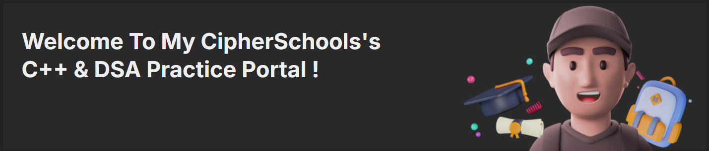

# Cipher Schools Daily Code Practice

<div align="center">
  
</div>

<p align="center">
  <i>A repository to showcase my daily C++ coding practice as part of Cipher Schools assignments.</i>
</p>

<div align="center">
  
  
  
</div>

---

## 🔍 Overview

This repository is dedicated to my ongoing journey in learning and mastering C++ through consistent daily practice. Each section contains solutions to various coding challenges designed to strengthen my understanding of algorithms, data structures, and general programming principles.

## 🛠 Skills Practiced

- **C++ Programming**
- **Problem Solving**
- **Algorithms**
- **Data Structures**
- **Code Optimization**
- **Object-Oriented Programming**

## 📂 Repository Structure

- **Core Concepts**: Focused on foundational C++ concepts.
- **Algorithms**: Implementation of various algorithms like sorting, searching, etc.
- **Data Structures**: Practical applications of arrays, linked lists, stacks, queues, etc.
- **Miscellaneous**: Other coding challenges and experiments.

## 🚀 How to Use

1. **Clone the repository**:
   ```bash
   git clone https://github.com/manpreetsidhhu/cipherschools.git
   
2. **Explore the directories to find the topics or challenges you're interested in.**

3. **Compile and run the C++ programs using your preferred IDE or command line.**

## 🤝 Contributing

I'm open to suggestions and contributions! If you have any ideas on how to improve the code or add new challenges, feel free to submit a pull request.

## 🌐 Connect

Let's connect and discuss more about coding and learning:

- [LinkedIn](https://www.linkedin.com/in/manpreetsinghsidhu/)
- [GitHub](https://github.com/manpreetsidhhu)

<p align="center">
  <i>Happy Coding! 😊</i>
</p>
